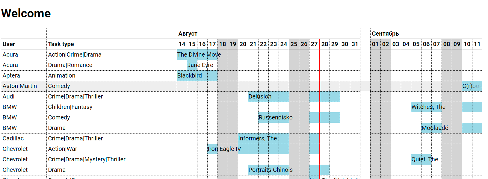

# timetask
Render Time task HTML table using TypeScript/JavaScript

# TimeTask HTML table
TypeScript/JavaScript UI library for generating calendar timetable with task. Task ordered by date with gaps between them and separated by rows if they periods had cross. Tasks gropped by User and type.

* Adapted to ES3
